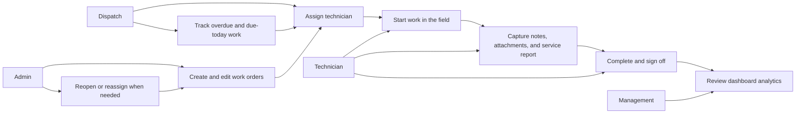
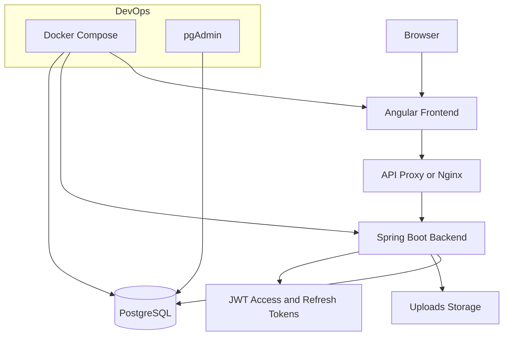
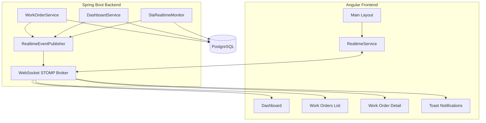
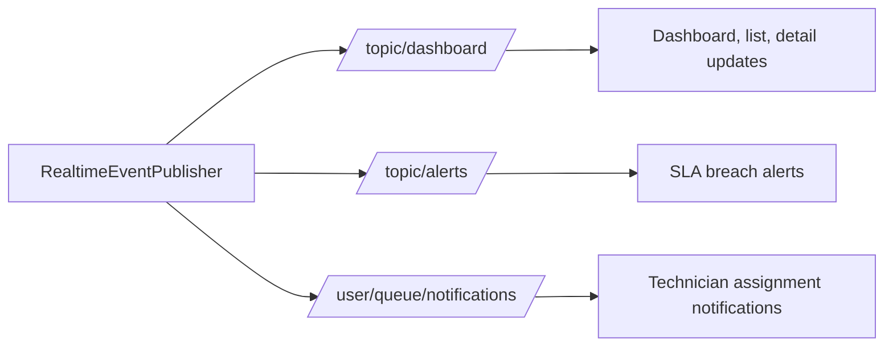
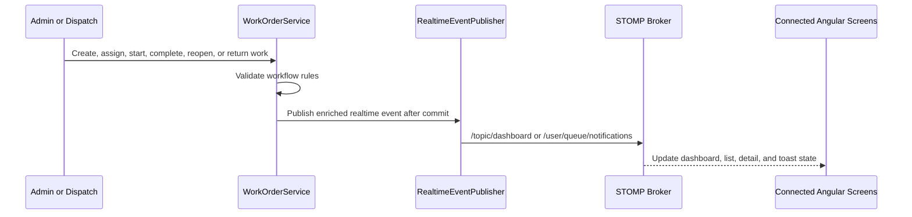
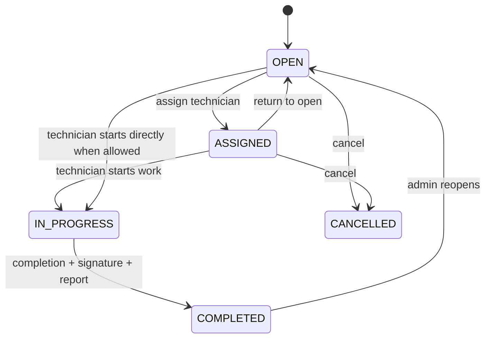
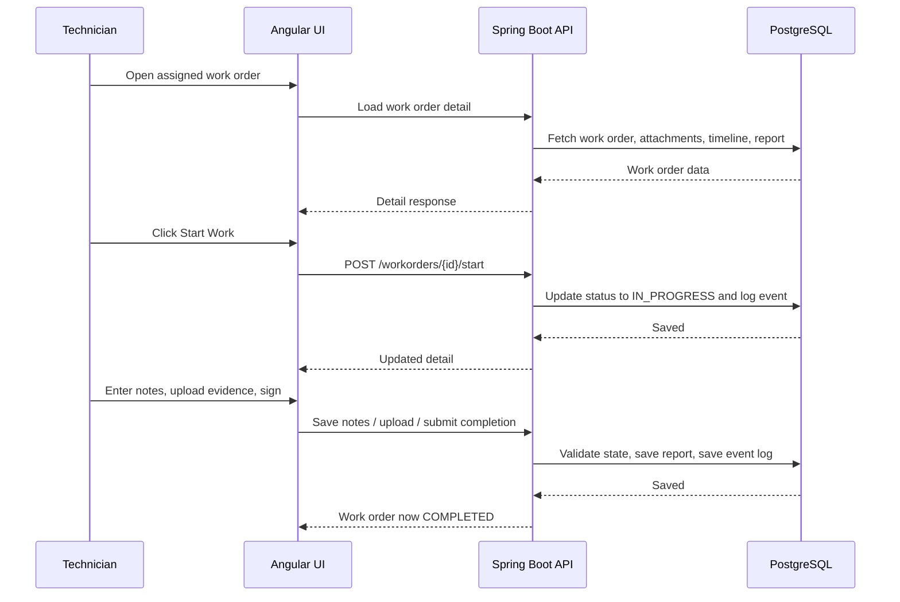
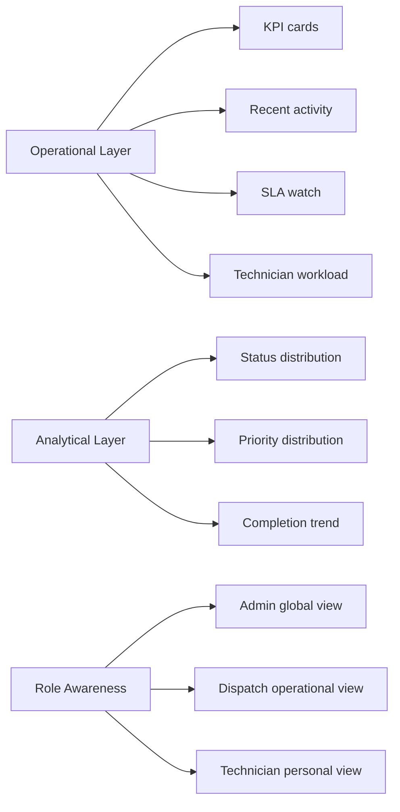

# A3 Field Service Management Platform

## Plain-English Overview

A3 Field Service Management is a full-stack platform for coordinating service work from the office to the field.

It helps:

- admins create and manage work orders
- dispatchers assign the right technician to the right job
- technicians start work, capture notes, upload evidence, complete jobs, and sign off in the field
- operations teams monitor workload, SLA pressure, and execution trends from the dashboard

The project is split into two repositories:

- a Spring Boot backend for business rules, security, APIs, and reporting
- an Angular frontend for the day-to-day user experience

This workspace brings both together so the application can be developed, tested, and packaged as one system.

## Visual Reading Guide

If someone is new to the project, the fastest way to understand it is to follow the diagrams in this order:

- start with the use case diagram to see who uses the platform and why
- move to the high-level architecture diagram to understand the current deployed shape
- review the current-state, future-state, and realtime business flow visuals later in this README for the clearest presentation-ready overview
- finish with the lifecycle and technician workflow diagrams to understand how the business process actually runs

## Portfolio Snapshot

This project is strongest when explained from both a business and engineering angle:

- business problem: field teams need a clearer way to assign, execute, complete, and monitor service work
- product solution: one shared platform for admin, dispatch, and technician users with role-aware workflows
- engineering value: strong backend workflow enforcement, structured reporting, dashboard analytics, Docker packaging, and a clear realtime evolution path
- operational value: better visibility, cleaner reporting, stronger auditability, and faster decision-making

## Why This Project Exists

In many field service teams, job coordination still happens across phone calls, spreadsheets, sticky notes, and memory. That creates a familiar set of problems:

- work orders are assigned late or inconsistently
- technicians do not always have a clean start-to-complete workflow
- notes and completion evidence are captured in different formats
- supervisors have limited visibility into overdue work
- reporting is delayed because the data is not structured

A3 FSM turns that into a traceable workflow with clear states, role-based actions, and audit-friendly reporting.

## Use Case Diagram



## Core Capabilities

### Work Order Operations

- create, edit, and track work orders
- assign and unassign technicians
- move work through a controlled lifecycle
- reopen completed jobs when more work is needed

### Technician Execution

- start work without waiting for admin intervention
- save working notes while on site
- upload attachments and evidence
- submit a structured completion report
- capture signature during final sign-off
- return a job to `OPEN` when work cannot proceed

### Dashboard And Analytics

- operational KPI cards
- recent activity feed with dashboard-friendly text
- status, priority, and completion trend analytics
- SLA watch for overdue and due-today jobs
- technician workload overview and heatmap foundation
- role-aware dashboards for admin, dispatch, and technician users

The quick architecture view below shows the current deployed shape of the platform. A more detailed current-state and future-state view appears later in this README.

## Why This Project Stands Out

- it reflects a real field-service workflow instead of a generic CRUD demo
- it connects office operations and technician execution in one lifecycle
- it treats the backend as the source of truth while still delivering guided UI behavior
- it already shows product thinking, architecture thinking, and scalability thinking in one codebase

## High-Level Architecture Diagram



## Sprint 8 Realtime Architecture

Sprint 8 stabilizes the platform as a modular monolith with event-driven realtime messaging.



### Realtime Channels



### Realtime Business Flow



## Repository Layout

```text
A3_SOLUTIONS_PROJECT/
|- README.MD
|- docker-compose.dev.yml
|- docker-compose.prod.yml
|- .env
|- docs/
|- observability/
|- A3 Field Service Management Backend/
|  |- README.MD
|  `- src/...
`- A3 Field Service Management Frontend/
   `- a3-fsm-frontend/
      |- README.md
      `- src/...
```

## High-Level Technical View

### Frontend

- Angular application with role-based routing and guarded screens
- dashboard, work order, technician, and authentication modules
- JWT-aware HTTP layer and session timeout behavior
- dashboard visualizations using summary, activity, analytics, SLA, and workload endpoints

### Backend

- Spring Boot REST API
- business rules enforced in the service layer
- PostgreSQL persistence with audit-style work order events
- JWT authentication and refresh-token support
- dashboard aggregation endpoints for operational and analytical views

### Infrastructure

- Docker Compose for frontend, backend, database, pgAdmin, and observability services
- split development and production-oriented compose files at the root workspace
- local uploads volume for evidence files
- local font bundling to avoid external Google Fonts build issues during containerized builds

## Work Order Lifecycle Flowchart

This is the core operational heartbeat of the platform.



## Technician Completion Flow



## Dashboard Layers

The dashboard is intentionally evolving in layers so it remains useful for operations today and extensible for analytics tomorrow.



## Quick Glossary

- `SLA`: the promised timing expectation for work, such as due today or overdue
- `KPI`: a quick metric that helps teams see how operations are performing
- `JWT`: the token-based sign-in method used to keep API calls secure
- `Heatmap`: a visual way to show workload intensity across technicians

## Sprint Progress Snapshot

### Sprint 5

Focused on technician execution and completion:

- start work flow
- return-to-open flow
- structured field completion report
- signature capture
- reopen workflow
- backend workflow enforcement
- timeline completeness
- session timeout and refresh token support

### Sprint 6

Focused on dashboard foundations:

- upgraded summary endpoint
- recent activity endpoint
- analytics endpoint
- charts for status, priority, and completion trend
- cleaner operational dashboard layout

### Sprint 7

Focused on role-aware operational intelligence:

- SLA summary and detail blocks
- due-today and overdue visibility
- technician workload API
- workload card panel
- heatmap-ready workload presentation
- fuller role-based dashboard behavior

### Sprint 8 Direction

The next natural step is real-time collaboration and live operational updates.

Expected direction:

- WebSocket-based live dashboard refresh
- real-time work order state updates
- role-specific live notifications
- richer dispatcher visibility

Kafka remains a future scaling option for event-driven processing, but it is not required for the current stage of the platform.

### Sprint 10 — Demo Readiness

Sprint 10 turns the production-style deployment into a portfolio-ready public demo:

- fictional Admin, Dispatcher, and Technician accounts with BCrypt-hashed passwords;
- realistic technicians, work orders, overdue items, timeline events, and completion reports;
- a visible demo-mode banner and one-click credentials on the login page;
- an opt-in `prod,demo` backend profile that leaves ordinary production defaults unchanged;
- a backup-first, confirmation-gated reset script for restoring clean demo data.

See the [Sprint 10 demo-mode runbook](./docs/DEMO_MODE.md) for activation and reset instructions.

### Sprint 11 — SLA Intelligence

Sprint 11 separates dispatch, technician response, execution, and full-resolution clocks. The execution SLA begins when the technician starts travel (or starts work through the compatibility path), then records near breach, breach, completion outcome, and technician performance.

The technician lifecycle is `OPEN → ASSIGNED → EN_ROUTE → ARRIVED → WORK_STARTED → COMPLETED`. See the [Sprint 11 SLA execution map](./docs/SPRINT_11_SLA_INTELLIGENCE.md).

## Visual Architecture Guide

The Mermaid overview above gives the quickest technical snapshot. The image-based diagrams below are the more presentation-ready visuals and are the best entry point for reviewers, stakeholders, and anyone who wants to understand the platform without reading implementation detail first.

If you are presenting the project live, these three visuals are the most useful sequence to show on screen.

### Current-State Architecture

.png>)

Today, A3 FSM runs as a practical monolithic full-stack application:

- Angular powers login, role-based navigation, dashboards, work order screens, and technician workflows
- Spring Boot handles authentication, business rules, workflow enforcement, dashboard aggregation, and realtime event publishing
- PostgreSQL stores users, technicians, work orders, events, completions, and attachment metadata

The current interaction model is intentionally simple:

- REST handles standard reads, writes, and business actions
- WebSocket handles live dashboard and notification updates
- one shared frontend serves admin, dispatch, and technician users with role-specific experiences

### Future-State Architecture

.png>)

This diagram represents a future evolution path rather than an immediate requirement. If the platform grows in scale or complexity, the backend can be separated into focused services such as:

- Auth Service
- Work Order Service
- SLA or Rules Service
- Dashboard or Analytics Service
- Notification or Realtime Service

In that future model:

- Kafka or another event bus can carry business events between backend services
- WebSocket still pushes live updates from backend services to browser clients
- the frontend experience can remain familiar even as the backend becomes more distributed

### Realtime Business Flow

.png>)

This flow shows how operational actions become live visibility across the platform:

- assignment updates can refresh workload views and recent activity immediately
- technician completion can update status, reporting, and analytics without a full page reload
- SLA breaches can surface overdue pressure to admin and dispatch dashboards in real time

A simple way to think about it:

- REST records the business action
- backend logic validates and saves it
- realtime messaging broadcasts the update
- dashboards refresh without waiting for a manual reload

## Suggested Demo Story

If you are walking someone through the project, this is a strong and simple narrative:

1. Start with the current-state architecture to show the full system at a glance.
2. Move to the work order lifecycle and technician completion flow to explain the real business workflow.
3. Show the dashboard layers and realtime business flow to highlight visibility and operational value.
4. End with the future-state architecture to show where Sprint 8 and later scaling can go.

## Audience Guide

If you are reviewing this project from different backgrounds, here is the easiest way to read it:

- non-technical stakeholders: focus on the business flow, lifecycle, dashboard sections, and sprint snapshot
- developers: move next into the backend and frontend READMEs for architecture, setup, and implementation detail
- reviewers, interviewers, and project assessors: use the diagrams to understand how the app maps real field operations into a traceable software workflow

## Running The Platform Locally

### Option 1: Run Repositories Separately

Use the backend and frontend README files for repo-specific commands and local development steps.

### Option 2: Run With Docker Compose

For day-to-day local development at the root workspace:

```bash
docker compose -f docker-compose.dev.yml --env-file .env up --build
```

Typical development endpoints:

- frontend: `http://localhost:4200`
- backend: `http://localhost:8080`
- pgAdmin: `http://localhost:5050`
- postgres host port: `5433`
- Prometheus: `http://localhost:9090`
- Grafana: `http://localhost:3000`
- PostgreSQL exporter: `http://localhost:9187/metrics`

### Option 3: Run A Production-Shaped Stack Locally

```bash
docker compose -f docker-compose.prod.yml --env-file .env up --build -d
```

Default production-shaped exposure:

- frontend: `http://localhost`
- Grafana: `http://localhost:3000`

In the production compose file, the backend, database, Prometheus, and PostgreSQL exporter stay on the internal Docker network by default.

## Data And Environment Notes

- the backend can bootstrap demo data for containerized development
- development compose keeps admin bootstrap enabled for intentional local setup, while production compose keeps admin bootstrap and self-registration disabled
- the Docker setup can also be pointed at your real local Postgres data
- uploads are stored on a mounted volume so evidence files survive container restarts
- the root compose files expect both sibling repositories to exist with the exact folder names already used in this workspace

## Documentation Map

- [User Stories](./docs/USER_STORIES.md)
- [Business Rules](./docs/BUSINESS_RULES.md)
- [System Design](./docs/SYSTEM_DESIGN.md)
- [Sprint 10 Demo Mode](./docs/DEMO_MODE.md)
- [Sprint 10 Execution Map](./docs/SPRINT_10_DEMO_READINESS.md)
- [Sprint 11 SLA Intelligence](./docs/SPRINT_11_SLA_INTELLIGENCE.md)
- [Backend README](./A3%20Field%20Service%20Management%20Backend/README.MD)
- [Frontend README](./A3%20Field%20Service%20Management%20Frontend/a3-fsm-frontend/README.md)

## Closing Summary

This platform is more than a task tracker. It is a field execution workflow shaped around how service teams actually work: assign, act, document, complete, review, and improve.

The architecture is intentionally practical:

- strict enough to protect business rules
- simple enough to understand quickly
- flexible enough to grow into real-time operations, deeper analytics, and role-based decision support
