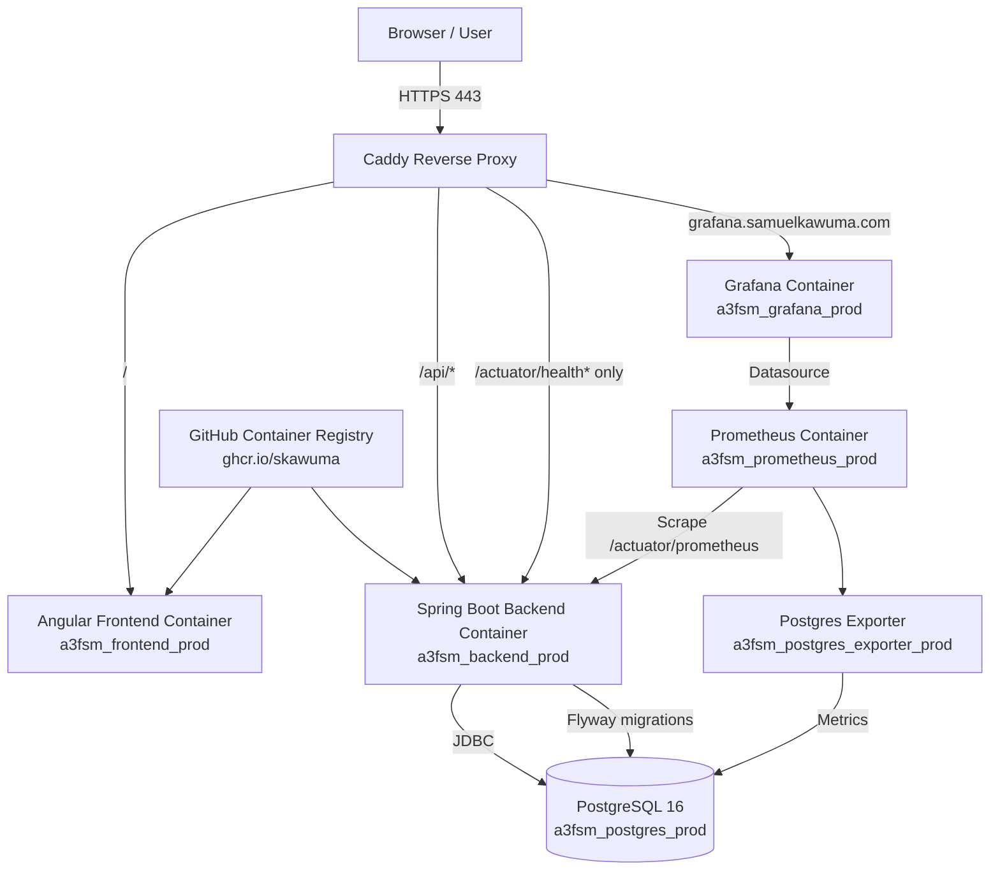

# A3 FSM Sprint 9 VPS Deployment State & Runbook

- **Project:** A3 Field Service Management App
- **Deployment phase:** Sprint 9 — Production DevOps / VPS Deployment
- **VPS provider:** Hostinger VPS
- **Deployment path on VPS:** `/opt/a3-fsm/A3-FSM-Deployment`
- **Primary app domain:** `https://fsm.samuelkawuma.com`
- **Grafana domain:** `https://grafana.samuelkawuma.com`
- **Deployment method:** Docker Compose using GHCR-published images
- **Current state:** Application deployed, HTTPS working, backend healthy, Flyway migrations applied, admin login confirmed.

> This document records the current production deployment state after live troubleshooting and validation. It replaces the earlier generic preparation-only runbook with the actual state of the Sprint 9 VPS deployment.

---

## 1. Executive Summary

A3 FSM has been deployed to the Hostinger VPS using Docker Compose and GHCR images. Caddy is currently acting as the public HTTPS reverse proxy for the Angular frontend, Spring Boot backend API, and Grafana.

The deployment successfully reached the authenticated dashboard at:

```text
https://fsm.samuelkawuma.com/dashboard
```

The dashboard recognized the production admin user:

```text
admin@a3solutions.com
Role: ADMIN
Welcome, System Admin
```

The production database is currently clean, so dashboard counts initially show zero technicians, work orders, open jobs, due-today items, overdue items, and completed jobs. This is expected for a fresh production database.

---

## 2. Confirmed Production URLs

| Service | Public URL | Status |
|---|---|---|
| A3 FSM frontend | `https://fsm.samuelkawuma.com` | Working |
| A3 FSM dashboard | `https://fsm.samuelkawuma.com/dashboard` | Working after login |
| Backend health through Caddy | `https://fsm.samuelkawuma.com/actuator/health` | Working |
| Grafana | `https://grafana.samuelkawuma.com` | Working; redirects to `/login` |
| Prometheus | Internal only: `http://prometheus:9090` | Running inside Docker network |
| PostgreSQL | Internal only: `db:5432` | Healthy inside Docker network |

Validated health response:

```json
{"status":"UP","groups":["liveness","readiness"]}
```

---

## 3. DNS Configuration

The following DNS records were created in Hostinger DNS for `samuelkawuma.com`:

```text
fsm.samuelkawuma.com       A       72.60.175.72
grafana.samuelkawuma.com   A       72.60.175.72
```

DNS resolution was confirmed from the local Mac terminal:

```sh
dig +short fsm.samuelkawuma.com
dig +short grafana.samuelkawuma.com
```

Expected result:

```text
72.60.175.72
```

---

## 4. Current Architecture



### Public edge

Caddy is the only intended public web edge for the A3 FSM stack.

Publicly exposed ports:

```text
80/tcp    HTTP challenge and redirect
443/tcp   HTTPS
```

Internal-only services:

```text
PostgreSQL      5432
Backend         8080
Frontend        80
Prometheus      9090
Grafana         3000
Postgres Exporter 9187
```

---

## 5. Actual Docker Compose Runtime State

The production stack is managed from:

```sh
cd /opt/a3-fsm/A3-FSM-Deployment
```

The active compose command pattern is:

```sh
docker compose --env-file .env.prod -f docker-compose.ghcr.yml <command>
```

Validated running services:

| Container | Image | Current state |
|---|---|---|
| `a3fsm_backend_prod` | `ghcr.io/skawuma/a3-fsm-backend:sprint-9-production-devops` | Healthy |
| `a3fsm_frontend_prod` | `ghcr.io/skawuma/a3-fsm-frontend:sprint-9-production-devops` | Running; repo healthcheck now uses `/` for the GHCR stack |
| `a3fsm_caddy_prod` | `caddy:2-alpine` | Running; owns ports 80/443 |
| `a3fsm_postgres_prod` | `postgres:16` | Healthy |
| `a3fsm_prometheus_prod` | `prom/prometheus:latest` | Running |
| `a3fsm_grafana_prod` | `grafana/grafana-oss:latest` | Running |
| `a3fsm_postgres_exporter_prod` | `quay.io/prometheuscommunity/postgres-exporter:latest` | Running |

Current Caddy public port mapping:

```text
0.0.0.0:80->80/tcp
0.0.0.0:443->443/tcp
```

---

## 6. Production `.env.prod` Variable Model

The deployed stack uses `.env.prod`, not `.env`.

Important active variable names:

```env
COMPOSE_PROJECT_NAME=a3fsm

BACKEND_IMAGE=ghcr.io/skawuma/a3-fsm-backend:sprint-9-production-devops
FRONTEND_IMAGE=ghcr.io/skawuma/a3-fsm-frontend:sprint-9-production-devops

FSM_DOMAIN=fsm.samuelkawuma.com
GRAFANA_DOMAIN=grafana.samuelkawuma.com

DB_NAME=a3fsm
DB_USERNAME=a3fsm_user
DB_PASSWORD=<redacted>

SPRING_DATASOURCE_URL=jdbc:postgresql://db:5432/a3fsm
SPRING_DATASOURCE_USERNAME=a3fsm_user
SPRING_DATASOURCE_PASSWORD=<redacted>

JWT_SECRET=<redacted>
JWT_EXPIRATION=3600000
JWT_REFRESH_EXPIRATION=604800000

CORS_ALLOWED_ORIGINS=https://fsm.samuelkawuma.com

SPRING_FLYWAY_ENABLED=true
SPRING_FLYWAY_BASELINE_ON_MIGRATE=true
SPRING_JPA_HIBERNATE_DDL_AUTO=validate

MANAGEMENT_ENDPOINTS_WEB_EXPOSURE_INCLUDE=health,info,prometheus,metrics
MANAGEMENT_ENDPOINT_HEALTH_PROBES_ENABLED=true

GF_SECURITY_ADMIN_USER=<redacted>
GF_SECURITY_ADMIN_PASSWORD=<redacted>

APP_AUTH_ALLOW_SELF_REGISTRATION=false
APP_AUTH_ALLOW_ADMIN_BOOTSTRAP=false
APP_AUTH_BOOTSTRAP_ADMIN_EMAIL=
APP_AUTH_BOOTSTRAP_ADMIN_PASSWORD=
```

### Security note

Several temporary values were used during troubleshooting and should be treated as exposed. Before declaring the deployment production-final, rotate:

```text
Admin password
JWT_SECRET
DB_PASSWORD
GF_SECURITY_ADMIN_PASSWORD
Any GHCR token used on the VPS
```

Do not commit `.env.prod` to Git.

---

## 7. Caddy HTTPS Configuration

The active Caddyfile is located at:

```sh
/opt/a3-fsm/A3-FSM-Deployment/vps/Caddyfile
```

Current intended configuration:

```caddy
{
    email {$ACME_EMAIL}
}

{$FSM_DOMAIN} {
    encode gzip zstd

    header {
        Strict-Transport-Security "max-age=31536000; includeSubDomains; preload"
        X-Content-Type-Options "nosniff"
        X-Frame-Options "DENY"
        Referrer-Policy "strict-origin-when-cross-origin"
    }

    handle /api/* {
        reverse_proxy backend:8080
    }

    handle /ws* {
        reverse_proxy backend:8080
    }

    handle /actuator/health* {
        reverse_proxy backend:8080
    }

    handle /actuator/* {
        respond "Not found" 404
    }

    handle {
        reverse_proxy frontend:80
    }
}

{$GRAFANA_DOMAIN} {
    encode gzip zstd

    header {
        Strict-Transport-Security "max-age=31536000; includeSubDomains; preload"
        X-Content-Type-Options "nosniff"
        X-Frame-Options "DENY"
        Referrer-Policy "strict-origin-when-cross-origin"
    }

    reverse_proxy grafana:3000
}
```

Important detail:

Use `handle /api/*`, not `handle_path /api/*`.

`handle_path` would strip `/api`, which would break Spring Boot endpoints such as:

```text
/api/auth/login
/api/dashboard/summary
/api/workorders
```

---

## 8. Troubleshooting History and Final Fixes

### 8.1 GHCR unauthorized error

Initial image pull failed with:

```text
Head "https://ghcr.io/v2/skawuma/a3-fsm-frontend/manifests/sprint-9-production-devops": unauthorized
```

Cause:

```text
The VPS Docker client was not authenticated to GHCR, or the GHCR package was private.
```

Fix:

```sh
docker logout ghcr.io
read -s GHCR_PAT
echo "$GHCR_PAT" | docker login ghcr.io -u skawuma --password-stdin
unset GHCR_PAT
```

After GHCR login, both images pulled successfully:

```text
ghcr.io/skawuma/a3-fsm-backend:sprint-9-production-devops
ghcr.io/skawuma/a3-fsm-frontend:sprint-9-production-devops
```

---

### 8.2 Caddy port 80/443 conflict with system Nginx

Caddy initially failed with:

```text
failed to bind host port 0.0.0.0:80/tcp: address already in use
```

Diagnosis showed system Nginx owned ports 80 and 443:

```sh
sudo ss -ltnp | grep -E ':80|:443'
sudo lsof -iTCP:80 -sTCP:LISTEN -P -n
sudo lsof -iTCP:443 -sTCP:LISTEN -P -n
```

Fix used during deployment:

```sh
sudo systemctl stop nginx
docker compose --env-file .env.prod -f docker-compose.ghcr.yml up -d caddy
```

Important operational note:

Do not restart system Nginx unless the long-term reverse proxy strategy is changed. If Nginx starts again, it can reclaim ports 80/443 and break Caddy.

Long-term decision still needed:

```text
Option A: Caddy becomes the main VPS reverse proxy.
Option B: Nginx remains the main reverse proxy and A3 FSM removes Caddy from compose.
```

Current deployment uses Option A.

---

### 8.3 Caddy DNS resolver problem inside container

Caddy initially failed to reach Let’s Encrypt with:

```text
lookup acme-staging-v02.api.letsencrypt.org on 127.0.0.53:53: read: connection refused
```

Diagnosis:

```sh
docker exec a3fsm_caddy_prod cat /etc/resolv.conf
```

Problem result:

```text
nameserver 127.0.0.53
```

Cause:

Docker container was inheriting Ubuntu `systemd-resolved` stub DNS, which was unreachable inside the container.

Fix added to the `caddy` service in `docker-compose.ghcr.yml`:

```yaml
dns:
  - 1.1.1.1
  - 8.8.8.8
```

Recreate Caddy:

```sh
docker compose --env-file .env.prod -f docker-compose.ghcr.yml up -d --force-recreate caddy
```

---

### 8.4 Frontend healthcheck alignment

During live troubleshooting, the frontend application was reachable over HTTPS and served successfully, but Docker could still show:

```text
a3fsm_frontend_prod   Up ... (unhealthy)
```

Cause:

The frontend healthcheck may be checking `/healthz`, but the current frontend image serves the Angular app at `/` and may not serve `/healthz`.

Repository fix applied to the GHCR compose stack:

```yaml
healthcheck:
  test: ["CMD-SHELL", "wget -qO- http://localhost/ || exit 1"]
  interval: 30s
  timeout: 5s
  retries: 3
  start_period: 15s
```

Recreate frontend:

```sh
docker compose --env-file .env.prod -f docker-compose.ghcr.yml up -d frontend
```

This keeps the deployment aligned with the working live behavior. The source-build dev/prod frontend image can still serve `/healthz` when its bundled Nginx config includes that endpoint.

---

### 8.5 Admin bootstrap did not create user

The users table was initially empty:

```sql
select id, email, role from users;
```

Result:

```text
(0 rows)
```

The `/api/auth/register` endpoint returned:

```text
401 Full authentication is required to access this resource
```

The backend container received bootstrap variables:

```text
APP_AUTH_BOOTSTRAP_ADMIN_EMAIL=admin@a3solutions.com
APP_AUTH_ALLOW_ADMIN_BOOTSTRAP=true
APP_AUTH_ALLOW_SELF_REGISTRATION=false
```

However, the deployed backend image did not create an admin user automatically during startup.

Resolution:

The first admin user was manually inserted into PostgreSQL after confirming the `users` table schema.

Actual `users` schema:

```text
id          bigint, primary key
first_name  varchar(255), not null
last_name   varchar(255), not null
email       varchar(255), unique, not null
password    varchar(255), not null
role        varchar(255), not null
active      boolean, not null, default true
```

Role constraint:

```text
ADMIN, DISPATCH, TECH
```

A BCrypt hash was generated and inserted. The first attempt was corrupted because shell expansion interpreted `$` characters in the hash. The valid hash had to be inserted safely using a shell variable and heredoc.

Safe pattern:

```sh
HASH=$(docker run --rm httpd:2.4-alpine htpasswd -bnBC 10 admin '<temporary-admin-password>' | cut -d: -f2)
HASH2A="${HASH/\$2y\$/\$2a\$}"

docker compose --env-file .env.prod -f docker-compose.ghcr.yml exec -T db \
psql -U a3fsm_user -d a3fsm <<SQL
update users
set password = '$HASH2A',
    role = 'ADMIN',
    active = true
where email = 'admin@a3solutions.com';
SQL
```

Validation query:

```sh
docker compose --env-file .env.prod -f docker-compose.ghcr.yml exec db \
psql -U a3fsm_user -d a3fsm -c "select id, email, role, active, length(password) as hash_length, left(password, 4) as hash_prefix from users;"
```

Expected:

```text
role = ADMIN
active = t
hash_length = 60
hash_prefix = $2a$
```

Login then returned access and refresh tokens successfully.

---

## 9. Flyway Migration State

Flyway was confirmed working.

Backend logs showed:

```text
Successfully applied 7 migrations to schema "public", now at version v7
```

Current Flyway migrations applied:

| Version | Description | Script |
|---|---|---|
| 1 | initial auth and users | `V1__initial_auth_and_users.sql` |
| 2 | technicians | `V2__technicians.sql` |
| 3 | work orders | `V3__work_orders.sql` |
| 4 | completion reports | `V4__completion_reports.sql` |
| 5 | attachments | `V5__attachments.sql` |
| 6 | work order events | `V6__work_order_events.sql` |
| 7 | indexes and constraints | `V7__indexes_and_constraints.sql` |

Current production tables:

```text
attachments
flyway_schema_history
technicians
users
work_order_completions
work_order_events
work_orders
```

Verification commands:

```sh
docker logs a3fsm_backend_prod | grep -i flyway

docker compose --env-file .env.prod -f docker-compose.ghcr.yml exec db \
psql -U a3fsm_user -d a3fsm -c "select * from flyway_schema_history;"
```

---

## 10. Smoke Test Results

### Confirmed successful

```sh
curl -I https://fsm.samuelkawuma.com
```

Observed result:

```text
HTTP/2 200
via: 1.1 Caddy
```

```sh
curl https://fsm.samuelkawuma.com/actuator/health
```

Observed result:

```json
{"status":"UP","groups":["liveness","readiness"]}
```

```sh
curl -I https://grafana.samuelkawuma.com
```

Observed result:

```text
HTTP/2 302
location: /login
via: 1.1 Caddy
```

Admin login test:

```sh
curl -sS -m 20 -X POST https://fsm.samuelkawuma.com/api/auth/login \
  -H "Content-Type: application/json" \
  -d '{
    "email": "admin@a3solutions.com",
    "password": "<admin-password>"
  }'
```

Observed result:

```json
{
  "accessToken": "<jwt-access-token>",
  "refreshToken": "<jwt-refresh-token>",
  "role": "ADMIN"
}
```

Browser test:

```text
https://fsm.samuelkawuma.com/dashboard
```

Observed result:

```text
Dashboard loaded.
User shown as admin@a3solutions.com.
Role shown as ADMIN.
Initial counts show 0 because database is fresh.
```

---

## 11. Commands for Current State Verification

Run from the VPS:

```sh
cd /opt/a3-fsm/A3-FSM-Deployment
```

Check services:

```sh
docker compose --env-file .env.prod -f docker-compose.ghcr.yml ps
```

Check Caddy public ports:

```sh
sudo ss -ltnp '( sport = :80 or sport = :443 )'
docker port a3fsm_caddy_prod
```

Check backend health:

```sh
curl https://fsm.samuelkawuma.com/actuator/health
```

Check database tables:

```sh
docker compose --env-file .env.prod -f docker-compose.ghcr.yml exec db \
psql -U a3fsm_user -d a3fsm -c "\dt"
```

Check users:

```sh
docker compose --env-file .env.prod -f docker-compose.ghcr.yml exec db \
psql -U a3fsm_user -d a3fsm -c "select id, first_name, last_name, email, role, active from users;"
```

Check Flyway:

```sh
docker compose --env-file .env.prod -f docker-compose.ghcr.yml exec db \
psql -U a3fsm_user -d a3fsm -c "select installed_rank, version, description, script, success from flyway_schema_history;"
```

Check Caddy logs:

```sh
docker logs --tail=100 a3fsm_caddy_prod
```

Check backend logs:

```sh
docker logs --tail=100 a3fsm_backend_prod
```

---

## 12. Monitoring State

### Prometheus

Prometheus runs internally as:

```text
a3fsm_prometheus_prod
```

Expected internal scrape targets:

```text
backend:8080/actuator/prometheus
postgres-exporter:9187
```

Recommended check:

```sh
docker compose --env-file .env.prod -f docker-compose.ghcr.yml exec prometheus \
wget -qO- http://backend:8080/actuator/prometheus | head
```

### Grafana

Grafana is reachable publicly through Caddy:

```text
https://grafana.samuelkawuma.com
```

Grafana should use Prometheus as a datasource:

```text
http://prometheus:9090
```

Grafana should not be exposed directly on port 3000.

---

## 13. Backup State

Backup setup is part of the deployment goal, but backup completion still needs final confirmation after smoke testing. The repo now includes backup and restore scripts that default to `.env.prod` and `docker-compose.ghcr.yml`.

Recommended backup folder:

```sh
mkdir -p /opt/a3-fsm/backups/db
```

Manual test:

```sh
cd /opt/a3-fsm/A3-FSM-Deployment
BACKUP_DIR=/opt/a3-fsm/backups/db ./scripts/backup-postgres.sh
ls -lh /opt/a3-fsm/backups/db
```

Restore test pattern:

```sh
cd /opt/a3-fsm/A3-FSM-Deployment
./scripts/restore-postgres.sh /opt/a3-fsm/backups/db/<backup-file>.dump
```

Cron recommendation after manual backup succeeds:

```cron
15 2 * * * cd /opt/a3-fsm/A3-FSM-Deployment && BACKUP_DIR=/opt/a3-fsm/backups/db ./scripts/backup-postgres.sh >> /opt/a3-fsm/backups/backup.log 2>&1
```

---

## 14. Remaining Production Hardening Checklist

Before calling the deployment production-final:

```text
[ ] Disable APP_AUTH_ALLOW_ADMIN_BOOTSTRAP.
[ ] Blank APP_AUTH_BOOTSTRAP_ADMIN_PASSWORD.
[ ] Rotate admin password.
[ ] Rotate JWT_SECRET because live tokens appeared during testing.
[ ] Rotate DB_PASSWORD before final public use.
[ ] Rotate GF_SECURITY_ADMIN_PASSWORD.
[x] Align GHCR frontend healthcheck with the working `/` route.
[ ] Confirm Prometheus is scraping backend and Postgres exporter.
[ ] Confirm Grafana datasource points to http://prometheus:9090.
[ ] Run manual database backup and confirm dump file exists.
[ ] Add cron backup schedule.
[ ] Decide long-term reverse proxy owner: Caddy or Nginx.
[ ] Prevent system Nginx from automatically reclaiming ports 80/443 if Caddy remains the public edge.
[ ] Run full app workflow smoke test: technician -> work order -> assignment -> timeline -> completion -> dashboard update.
```

---

## 15. Current Deployment Classification

Current state:

```text
Deployment status: Live and authenticated
Environment: Production-style VPS deployment
Public HTTPS: Working
Backend health: Healthy
Database migrations: Complete through Flyway v7
Admin login: Working
Monitoring stack: Running
Backups: Pending final setup/verification
Production hardening: In progress
```

This deployment is now beyond preparation. It is a functioning Sprint 9 production-style deployment with remaining hardening and operational tasks.
