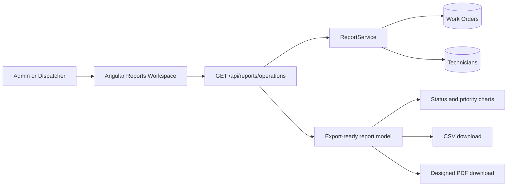

# Sprint 12 - Product Polish

## Purpose

Sprint 12 turns the production-ready A3 FSM platform into a presentation-ready product. It preserves the Angular routes, guards, services, realtime flows, and Spring Boot business rules while applying a consistent enterprise SaaS design system around them.

## Product outcomes

- responsive navigation that works on desktop, tablet, and mobile
- a shared visual language for dashboards, work orders, technicians, and reports
- role-specific dashboard framing for Admin, Dispatcher, and Technician users
- date-filtered operational reporting for Admin and Dispatcher users
- downloadable CSV and designed PDF exports
- portfolio-ready GitHub documentation and screenshots

## Design system

The visual layer uses shared CSS tokens instead of isolated component colors.

| Token group | Purpose |
|---|---|
| Brand | Primary blue, deep navigation blue, and soft primary backgrounds |
| Status | Success, warning, danger, and muted operational states |
| Surfaces | Application background, cards, subtle panels, and borders |
| Typography | Strong headings, body text, and muted supporting copy |
| Shape | Reusable 10px, 14px, and 18px radii |
| Elevation | Soft operational card and modal shadows |

The sidebar, toolbar, page headers, KPI cards, report panels, tables, badges, and responsive breakpoints all consume the same tokens.

## Role dashboard intent

| Role | Primary dashboard question |
|---|---|
| Admin | How is the service organization performing? |
| Dispatcher | Where is workload or SLA pressure building now? |
| Technician | What do I need to execute next? |

The underlying Sprint 11 dashboard intelligence remains intact. Sprint 12 improves information hierarchy, responsive behavior, role framing, and access to reports.

## Reports architecture

The API accepts an inclusive `from` and `to` date range of up to 366 days. It returns:

- total, active, completed, cancelled, and breached work orders
- SLA compliance and completed-within-SLA totals
- average time to assign, embark, and resolve
- status and priority distribution buckets
- technician SLA scorecards
- export-ready work-order detail rows

## Export behavior

### CSV

CSV exports include UTF-8 BOM support, escaped values, clear column headers, lifecycle state, technician, SLA outcome, and resolution time.

### PDF

PDF exports use a landscape operational-report layout with:

- branded report header and period
- KPI summary strip
- technician SLA performance table
- paginated work-order detail table
- consistent headers, footers, and page numbering

## Security and access

- `/reports` is guarded in Angular for `ADMIN` and `DISPATCH`.
- `/api/reports/operations` is protected with method-level Spring Security for the same roles.
- Technician users continue to receive their personal execution dashboard and cannot access organization-wide reports.

## Verification checklist

- backend unit and integration tests pass
- frontend typecheck and production build pass
- report period validation rejects reversed or excessive date ranges
- desktop and mobile navigation render without horizontal page overflow
- CSV export downloads with the selected reporting period
- PDF export renders without clipped text, overlapping tables, or broken page footers
- Admin/Dispatcher can access Reports; Technician cannot
- final production screenshots are captured from the deployed Sprint 12 images

## Production rollout

Sprint 12 is deployed from `sprint-12-product-polish` using the GHCR frontend and backend images. The July 1, 2026 production verification confirmed:

- both application containers report healthy
- public readiness reports `UP`
- unauthenticated report requests return `401`
- the Dispatcher demo account receives a complete `200` operations report
- CSV generation preserves UTF-8 BOM and safely quotes commas and embedded quotation marks
- PDF generation against the production report payload renders a clean A4 landscape report
- desktop Dashboard and Reports views render without browser console errors
- the 390px mobile shell exposes the navigation drawer without horizontal overflow
- final 1280x720 production screenshots are stored in `docs/screenshots`

Production-shaped data exposed an incomplete legacy timing record that could return `500` while calculating technician averages. Backend commit `73de471` handles missing timing data safely and adds a regression test; the corrected image was rebuilt, published, deployed, and verified against the same authenticated request.

## Portfolio explanation

Sprint 12 demonstrates the layer of engineering between a working system and a credible product. The release converts mature field-service workflows and SLA intelligence into a coherent, responsive SaaS experience. It also adds management reporting with CSV and PDF exports, role-aware navigation, and a documented design system without replacing the proven Angular and Spring Boot architecture.
