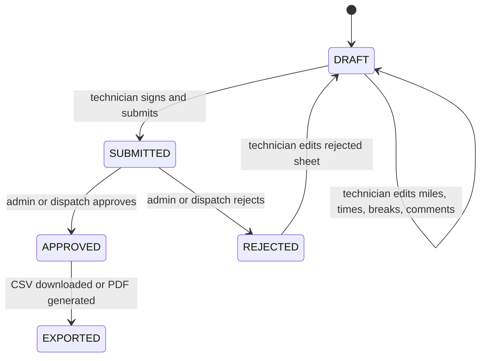
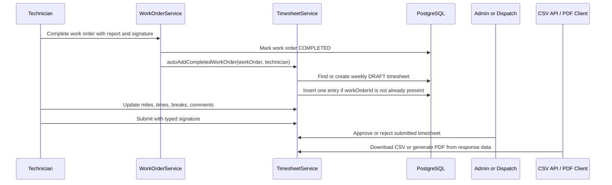

# Sprint 13 - Timesheet Automation And Payroll Reporting

## Purpose

Sprint 13 connects completed field work to weekly payroll reporting. The feature keeps work orders as the source of truth, automatically creates timesheet rows from completed jobs, and gives technicians and reviewers a structured weekly workflow.

## Product outcomes

- weekly technician timesheet workspace
- automatic entry creation when a work order is completed
- editable miles, onsite/offsite times, break times, and comments
- typed technician signature on submission
- Admin and Dispatcher payroll review queue
- approve and reject workflow for submitted timesheets
- backend CSV export for payroll handoff
- frontend PDF export for portfolio-friendly weekly timesheet output
- AOP logging and Swagger/OpenAPI documentation for Timesheet operations

## Timesheet workflow

## Automation flow

## Access and business rules

| Rule | Current behavior |
|---|---|
| Technician ownership | TECH users can view, edit, submit, and export only their own timesheets. |
| Reviewer access | ADMIN and DISPATCH can list, review, approve, reject, and export timesheets. |
| Edit lock | APPROVED timesheets cannot be edited by technicians. |
| Duplicate prevention | A completed work order is added to a timesheet only once. |
| Submission guard | A timesheet must contain at least one valid entry and a typed signature before submission. |
| Export split | CSV is served by the backend; PDF is generated by the Angular client. |

## API surface

The Timesheet API is grouped in Swagger UI under `Timesheets` and documents:

- `GET /api/timesheets/my/current`
- `GET /api/timesheets/my?weekStart=YYYY-MM-DD`
- `GET /api/timesheets/{id}`
- `PUT /api/timesheets/entries/{entryId}`
- `POST /api/timesheets/{id}/submit`
- `POST /api/timesheets/{id}/approve`
- `POST /api/timesheets/{id}/reject`
- `GET /api/timesheets`
- `GET /api/timesheets/{id}/export/csv`

## Observability

Timesheet service operations emit structured AOP logs using `event=timesheet.operation.start`, `event=timesheet.operation.success`, and `event=timesheet.operation.failure`.

The logs include safe operational context such as actor, role, timesheet id, technician id, work order id, target status, result count, export byte size, and duration. They intentionally avoid JWTs, passwords, authorization headers, and full signature text.

## Roadmap follow-up

The A3/WWTS contract completion form is still a follow-up item. The intended path is to generate a formal document from already-captured work order, completion report, technician, and timesheet data without requiring duplicate field entry.
