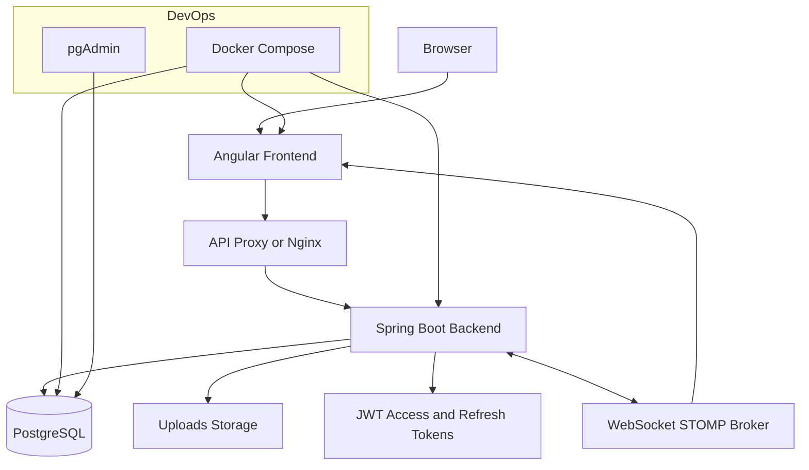
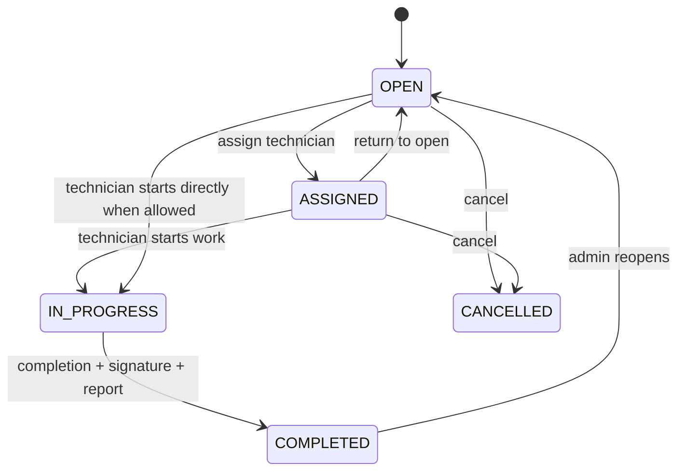
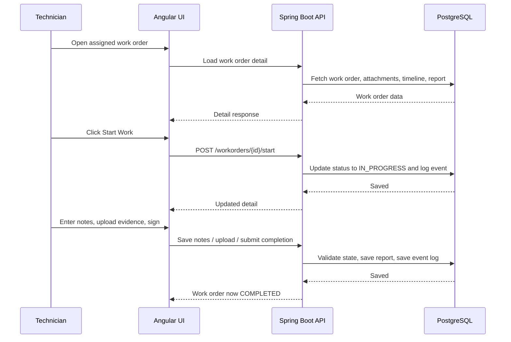
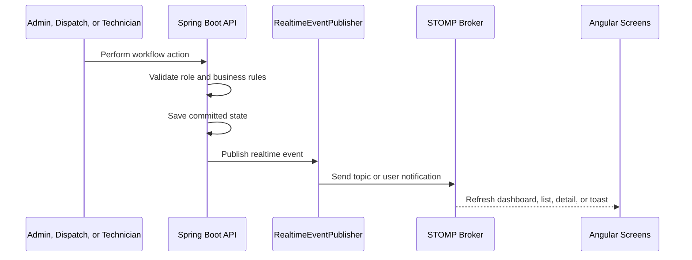

# System Design

## Purpose

This document describes the system design for the A3 Field Service Management platform. It expands the architecture and workflow diagrams from the root README into a more detailed design reference.

## Design Goals

- Provide one shared platform for admin, dispatch, technician, and management workflows.
- Keep backend services responsible for business rule enforcement.
- Give field users a clear start-to-complete execution flow.
- Give office users operational visibility through dashboards, SLA views, and recent activity.
- Support local development and packaged deployment through Docker Compose.
- Allow the current modular monolith to evolve toward more event-driven or service-separated architecture later.

## Current Architecture

The current system is a full-stack application with these main parts:

- Angular frontend for role-aware user experience.
- Spring Boot backend for REST APIs, authentication, workflow rules, reporting, and realtime publishing.
- PostgreSQL database for persisted operational data.
- Upload storage for field evidence files.
- WebSocket STOMP messaging for live dashboard and notification updates.
- Docker Compose for local orchestration of frontend, backend, database, and pgAdmin.

## Frontend Design

The Angular frontend provides the day-to-day operational interface.

Main responsibilities:

- Authenticate users and manage session behavior.
- Route users to role-appropriate screens.
- Display dashboards, work order lists, work order detail, technician workflows, and reporting views.
- Call backend REST APIs for standard reads and writes.
- Subscribe to realtime channels for dashboard, list, detail, alert, and notification updates.
- Guide users toward valid workflow actions based on role and work order state.

Important principle:

- The frontend improves usability and prevents obvious mistakes, but the backend remains the source of truth for workflow validation.

## Backend Design

The Spring Boot backend owns the platform's business behavior.

Main responsibilities:

- Authenticate users and issue JWT access and refresh tokens.
- Enforce role-based access to protected APIs.
- Validate work order lifecycle transitions.
- Manage technician assignment, reassignment, start work, return-to-open, completion, cancellation, and reopening.
- Store work order events for audit-friendly timelines.
- Aggregate dashboard data for KPIs, SLA views, workload views, recent activity, and analytics.
- Publish realtime events after successful workflow changes.

Key backend modules:

- Work order services for lifecycle and field execution behavior.
- Dashboard services for operational and analytical summaries.
- Authentication and security services for protected access.
- Realtime publisher for WebSocket/STOMP messages.
- SLA monitoring logic for due-today and overdue visibility.

## Data Design

The database stores operational state that supports workflow, reporting, and auditability.

Core data areas:

- Users and roles.
- Technicians.
- Work orders.
- Work order assignments.
- Work order events or timeline records.
- Completion reports.
- Attachment metadata.
- Dashboard and reporting source data.

Upload files are stored separately from the database, while metadata links each file back to its work order.

## Work Order Flow

This lifecycle keeps the system aligned with the real business process:

- Create the job.
- Assign or start the job.
- Perform the work.
- Capture evidence and completion details.
- Complete, reopen, or cancel as needed.

## Technician Completion Flow

## Realtime Design

Realtime behavior is designed around committed backend events.

Main channels:

- `/topic/dashboard` for shared dashboard and list refreshes.
- `/topic/alerts` for SLA or operational alerts.
- `/user/queue/notifications` for role-specific or user-specific notifications.

## Dashboard Design

The dashboard is layered so the platform is useful for operations now and analytics later.

- Operational layer: KPI cards, recent activity, SLA watch, technician workload.
- Analytical layer: status distribution, priority distribution, completion trend.
- Role-aware layer: admin global view, dispatch operational view, technician personal view.

Dashboard data should be derived from backend state so the UI reflects real workflow activity rather than temporary frontend-only state.

## Deployment Design

The workspace uses two Docker Compose entry points so development and production-shaped runs stay understandable.

Development compose `docker-compose.dev.yml` includes:

- Angular frontend on `http://localhost:4200`
- Spring Boot backend on `http://localhost:8080`
- PostgreSQL on host port `5433`
- pgAdmin on `http://localhost:5050`
- Prometheus on `http://localhost:9090`
- Grafana on `http://localhost:3000`
- PostgreSQL exporter on `http://localhost:9187/metrics`

Production compose `docker-compose.prod.yml` keeps the same core services but narrows exposure:

- Frontend is published on `http://localhost`
- Grafana remains published on `http://localhost:3000`
- Backend, PostgreSQL, Prometheus, and the PostgreSQL exporter stay on the internal Docker network by default
- JWT secrets are sourced from Docker secrets instead of plain environment variables
- Production disables self-registration, disables admin bootstrap, and keeps Flyway enabled with Hibernate validation

## Future-State Design Direction

The current modular monolith is practical for the project stage. If the platform grows, it can evolve into focused services:

- Auth Service.
- Work Order Service.
- SLA or Rules Service.
- Dashboard or Analytics Service.
- Notification or Realtime Service.

Kafka or another event bus can be introduced later for stronger event-driven processing between services. The frontend can remain familiar while backend responsibilities become more distributed.

## Design Principles

- Backend workflow enforcement is mandatory.
- Realtime updates happen after backend validation and persistence.
- Role awareness exists in both the frontend experience and backend authorization.
- Work order history should remain auditable.
- The design should stay understandable enough for portfolio review while being realistic enough to represent field service operations.
